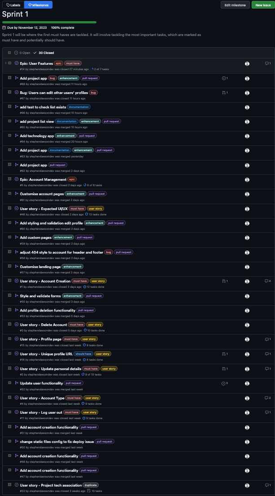

# Agile Methodology

## Overview

For my project, I am using a Github Project board. I'm utilising Github's milestones to track my progress, as well as their `.yml` issue templates for creating templates for Bugs, User stories and Epics. I have also set up simple workflows that will automatically move issues to the appropriate columns as they are created and closed.

## Agile Tools

### Project Board

The project board is split into 4 columns:

- Backlog
- To Do
- In Progress
- Done

The backlog column is where I store all of my issues that I have created. I then move them into the To Do column when I am ready to start working on them. Once I have started working on them, I will move them into the In Progress column. Once I have completed the issue, I will move it into the Done column.

### Milestones

I had initially created three phrases for the project, which were:

- Development Phase 1 (One week and a half)
- Development Phase 2 (Two weeks)
- Testing and Development Phase (1 week)

After considering the purpose of the Agile methodology, I decided to break down the project into smaller milestones. I have created 5 milestones, which are:

- Sprint 1 (One week)
- Sprint 2 (One week)
- Sprint 3 (One week)
- Sprint 4 (5 days)
- Testing and Development Phase (5 days)

### Issues

I created three issue templates, which are:

- Bug
- User Story
- Epic

I created the templates as `.yml` files so that it takes advantage of Github's [issue forms](https://docs.github.com/en/communities/using-templates-to-encourage-useful-issues-and-pull-requests/about-issue-and-pull-request-templates) feature. One great advantage of `.yml` templates is that you can automatically add the issue to a project board, which isn't possible with `.md` templates.

###  Labels

I utilised some existing labels and created a few labels to help me organise my issues. The labels I used are:

- `bug` (existing) - Used to identify bugs
- `duplicate` (existing) - Used to identify duplicate issues
- `enhancement` (existing) - Used to identify enhancements
- `user story` (custom) - Used to identify user stories
- `epic` (custom) - Used to identify epics
- `must have` (custom) - Used to identify must have issues
- `should have` (custom) - Used to identify should have issues
- `could have` (custom) - Used to identify could have issues
- `won't have` (custom) - Used to identify won't have issues
- `pull request` (custom) - Used to more easily identify pull requests on the project board

### Workflows

I enabled three of the set workflows on the project (two were already enabled):

- [Automatically add project cards to the backlog column](https://github.com/users/stephendawsondev/projects/5/workflows/13073386)

- [Automatically move project cards to the done column when issues are closed](https://github.com/users/stephendawsondev/projects/5/workflows/13068501)

- [Automatically add any reopened issues to the Todo column](https://github.com/users/stephendawsondev/projects/5/workflows/13073840)

## Sprints - Notes and learnings

[Click here to see the closed Sprints](https://github.com/stephendawsondev/StackPortfolio/milestones?state=closed)

### Sprint 1 notes

> "Sprint 1 will be where the first must haves are tackled. It will involve tackling the most important tasks, which are marked as must have and potentially should have."

- My first sprint was actually 9 days long. I had done my project planning and initial deployment beforehand so that I could start development with the first sprint.
- The first sprint was a success in the sense that I was able to complete the issues that I had planned to complete for the MVP (minimum viable product).
- I overestimated the time it would take to complete the combination of issues. I wanted the sprint to finish on the day I set, so I added some more issues to the sprint and worked on them.
- I underestimated how difficult it would be to create custom accounts, so that took more time than I anticipated. I also encounted some bugs for which I created new issues. However, I had created issues for a profile page, which I found was so tightly linked to the account issue that most of the work was already done.
- During the sprint, I also had an issue getting Tailwind CSS and DaisyUI to work with my project. In hindsight, I wish I had spent more time researching the setup of those frameworks. I ended up figuring most issues out, but I also had to create a couple of bug issues for them.
- I finished the sprint today (Sunday 12th Nov, 2023) and will be using today to plan the next sprint, and potentially get started.

