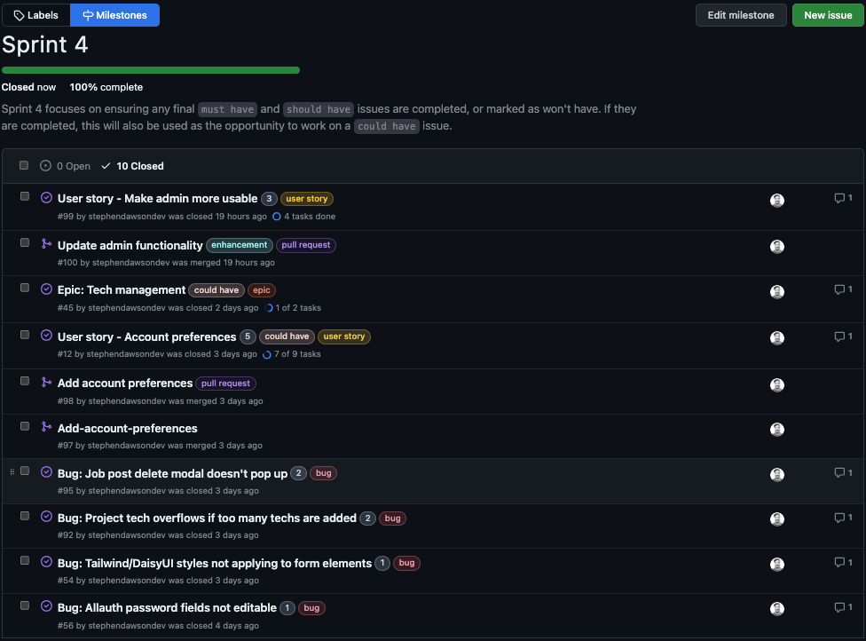

# Agile Methodology

[Click here to go back to the README.md file](README.md)

## Overview

For my project, I am using a Github Project board. I'm utilising Github's milestones to track my progress, as well as their `.yml` issue templates for creating templates for Bugs, User stories and Epics. I have also set up simple workflows that will automatically move issues to the appropriate columns as they are created and closed.

## Agile Tools

### Project Board

The project board is split into 4 columns:

- Backlog
- To Do
- In Progress
- Done

The backlog column is where I store all of my issues that I have created. I then move them into the To Do column when I am ready to start working on them. Once I have started working on them, I will move them into the In Progress column. Once I have completed the issue, I will move it into the Done column.

### Milestones

I had initially created three phrases for the project, which were:

- Development Phase 1 (One week and a half)
- Development Phase 2 (Two weeks)
- Testing and Development Phase (1 week)

After considering the purpose of the Agile methodology, I decided to break down the project into smaller milestones. I have created 5 milestones, which are:

- Sprint 1 (One week)
- Sprint 2 (One week)
- Sprint 3 (One week)
- Sprint 4 (5 days)
- Testing and Development Phase (5 days)

### Issues

I created three issue templates, which are:

- Bug
- User Story
- Epic

I created the templates as `.yml` files so that it takes advantage of Github's [issue forms](https://docs.github.com/en/communities/using-templates-to-encourage-useful-issues-and-pull-requests/about-issue-and-pull-request-templates) feature. One great advantage of `.yml` templates is that you can automatically add the issue to a project board, which isn't possible with `.md` templates.

###  Labels

I utilised some existing labels and created a few labels to help me organise my issues. The labels I used are:

- `bug` (existing) - Used to identify bugs
- `duplicate` (existing) - Used to identify duplicate issues
- `enhancement` (existing) - Used to identify enhancements
- `user story` (custom) - Used to identify user stories
- `epic` (custom) - Used to identify epics
- `must have` (custom) - Used to identify must have issues
- `should have` (custom) - Used to identify should have issues
- `could have` (custom) - Used to identify could have issues
- `won't have` (custom) - Used to identify won't have issues
- `pull request` (custom) - Used to more easily identify pull requests on the project board

### Workflows

I enabled three of the set workflows on the project (two were already enabled):

- [Automatically add project cards to the backlog column](./documentation/workflows/workflow1.png)

- [Automatically move project cards to the done column when issues are closed](./documentation/workflows/workflow2.png)

- [Automatically add any reopened issues to the Todo column](./documentation/workflows/workflow3.png)

## Sprints - Notes and learnings

[Click here to see the closed Sprints](https://github.com/stephendawsondev/StackPortfolio/milestones?state=closed)

### Sprint 1 notes

> "Sprint 1 will be where the first must haves are tackled. It will involve tackling the most important tasks, which are marked as must have and potentially should have."

- My first sprint was actually 9 days long. I had done my project planning and initial deployment beforehand so that I could start development with the first sprint.
- The first sprint was a success in the sense that I was able to complete the issues that I had planned to complete for the MVP (minimum viable product).
- I overestimated the time it would take to complete the combination of issues. I wanted the sprint to finish on the day I set, so I added some more issues to the sprint and worked on them.
- I underestimated how difficult it would be to create custom accounts, so that took more time than I anticipated. I also encountered some bugs for which I created new issues. However, I had created issues for a profile page, which I found was so tightly linked to the account issue that most of the work was already done.
- During the sprint, I also had an issue getting Tailwind CSS and DaisyUI to work with my project. In hindsight, I wish I had spent more time researching the setup of those frameworks. I ended up figuring most issues out, but I also had to create a couple of bug issues for them.
- I finished the sprint today (Sunday 12th Nov, 2023) and will be using today to plan the next sprint, and potentially get started.

### Sprint 2 notes

> "This task also focuses on doing the must have tasks, as well as also taking on some should have tasks if possible."

- I started this sprint when I finished the first sprint, on Sunday 12th Nov, 2023.
- I found myself held up in this sprint by my own form validation code. I had mixed it with the stepper code, so I spent some times pulling that out and making it work. It made me realise that I should have mapped out what the form validation would look like when I was planning.
- In this sprint, I also applied the fonts from my planning, but I found that I actually preferred the base font from the Tailwind framework. I applied my heading styles but kept the base font for the body.
- I encountered some bugs in this sprint. I managed to address one, but I have added the others to the backlog to address later.
- I started using `include` for code snippets. I didn't realise it was something that I would be able to use before starting, so I spent some time refactoring my code so that I could use it for cards and badges.
- I was able to complete all but one of my planned issues for this sprint, but it is also that I was focusing on core code and not automated testing. For the next sprint, I will be doing mostly `could have` issues.
- Something I wish I had done is use story points for planning the tasks. I will apply those retroactively to my issues to gauge the difficulty level, and apply them to future issues. I plan to use them in the next sprint.
- I finished the sprint today (Sunday 19th Nov, 2023).

### Sprint 3 notes

> "Sprint 3 will focus on coding, but it will be used to finishing up and must haves or should haves from previous sprints, while also tackling could haves if time allows."

- I started this sprint when I finished the second sprint, on Sunday 19th Nov, 2023.
- I used story points in this sprint and also retroactively assigned values to issues from the previous sprints. That allowed me to see how much work I was able to get done in the allotted time and plan accordingly.
- I had less time to dedicate to this sprint, so I had fewer issues overall.
- The issue regarding social authentication took a lot more time than I had originally anticipated, but the issues for search and filtering didn't take as long, so it more or less balanced out.
- All planned issues were completed, plus the other search and filtering issues, which I had originally thought would be in the next sprint.
- I finished the sprint today (Sunday 26th Nov, 2023). For the next sprint, I will evaluate the remaining `could have` issues and focus on resolving the remaining bugs. I also want to run through the application and see if there are any other issues that I can add to the backlog.

### Sprint 4 notes

> Sprint 4 focuses on ensuring any final must have and should have issues are completed, or marked as won't have. If they are completed, this will also be used as the opportunity to work on a could have issue.

- I started this sprint the day after I finished the third sprint, on Monday 27th Nov, 2023.
- I had less time available for this sprint, but I was able to plan accordingly thanks to my previous work with story points.
- I completed all but one of my planned issues in this sprint. The issue I didn't complete turned out to have a lot of unexpected complexity. It is [issue #41](https://github.com/stephendawsondev/StackPortfolio/issues/41) - I marked it as `won't have` for now, but I will revisit it in the future.
- I also added another user story because I felt that the admin was lacking in functionality. I completed the issue and the admin now looks much better.
- In this sprint, I had the opportunity to tackle a few bugs that had come up throughout the project and added in some more automated testing.
- I was considering adding a testing step in my build workflow, but I decided against it as it might be too time consuming.
- I finished the sprint today (Thursday 30th Nov, 2023). For the testing and documentation phase, I will no longer be working on features. I will instead be focusing on manual testing and finishing up the documentation.

### Testing and Documentation phase notes

> While testing and documenting should be done throughout the project, this phase focuses on carrying out final manual tests and fixing up the documentation.

- I started this phase the day after I finished the fourth sprint, on Friday 1st Dec, 2023.
- I had holidays planned that fell during the project submission, so the testing and documentation was done over some weeks.
- Most of the automated testing had been done before this phase, so I focused on manual testing. I would like to add more automated tests in the future, but I was able to do a lot of manual testing, which compensated for it somewhat.
- I came across some bugs and UX improvements during this phase. I only came across one bug that was severe enough to require me to go out of my way to fix it, which can be seen in the below screenshot.
- I also added some more documentation, particularly to the main README.md and TESTING.md files.
- I finished the phase today (Tuesday 19th Dec, 2023) and I will be submitting the project today or tomorrow.

