#  StackPortfol.io

StackPortfol.io is a platform that allows Developers to add showcase their projects and associate them with the skills that they used to create them. Since the skills are linked to projects, Recruiters have peace of mind that the Developers they are contacting have the skills that they say they have.

## Planning Phase

###  Site objective

While Developers can use a site such as LinkedIn to add projects, the architecture is set to to serve the needs of a number of different job functions. Due to the fact that the site us not focused on Developers, the project showcase lacks many features that Developers need. Recruiters who are searching for Developers for role lack the evidence that a Developer has the skills for which they are searching. In many cases, a skill might be added to a professional profile just because someone has heard or watched a video about it.

StackPortfol.io allows Developers to showcase their projects, which then allows Recruiters to find Developers who have proven skills for their job postings. It's a win-win for both parties.

###  Opportunities

Being a Developer myself, I have a lot of feature ideas for the Stackportfol.io platform. I have listed them in the table below, rating them by their importance and difficulty. The rating system is based on the MoSCoW method of prioritisation.

| Feature                         | Importance | Difficulty | Project priority |
| ------------------------------- | ---------- | ---------- | ---------------- |
| **Account Features**            |            |            |                  |
| Account creation                | 5          | 3          | Must have        |
| Account login                   | 5          | 3          | Must have        |
| Account logout                  | 5          | 3          | Must have        |
| Account deletion                | 5          | 2          | Must have        |
| Account update                  | 5          | 3          | Must have        |
| Account preferences             | 3          | 4          | Could have       |
| Social login/registration       | 3          | 4          | Could have       |
| **User Features**               |            |            |                  |
| User profiles                   | 5          | 3          | Must have        |
| User profile search             | 3          | 4          | Could have       |
| User messaging system           | 1          | 5          | Won't have       |
| User notifications              | 1          | 5          | Won't have       |
| User activity feed              | 1          | 5          | Won't have       |
| Tech user unique profile URL    | 4          | 3          | Should have      |
| Job seeking types               | 1          | 4          | Won't have       |
| **Project Features**            |            |            |                  |
| Project creation                | 5          | 3          | Must have        |
| Project update                  | 5          | 3          | Must have        |
| Project deletion                | 5          | 3          | Must have        |
| Project search                  | 3          | 4          | Could have       |
| Project tech association        | 5          | 4          | Must have        |
| Project Contributors            | 3          | 5          | Won't have       |
| Project commenting              | 2          | 5          | Won't have       |
| Report job post/project         | 2          | 5          | Won't have       |
| Project/Job post bookmarking    | 2          | 5          | Won't have       |
| **Job Features**                |            |            |                  |
| Job creation                    | 5          | 3          | Must have        |
| Job update                      | 5          | 3          | Must have        |
| Job deletion                    | 5          | 3          | Must have        |
| Job search                      | 2          | 4          | Could have       |
| Job list                        | 4          | 3          | Should have      |
| Job post tech                   | 5          | 3          | Must have        |
| Job remote/on-site/hybrid       | 4          | 2          | Should have      |
| Job post benefits               | 2          | 4          | Won't have       |
| Job post salary                 | 3          | 2          | Should have      |
| Job post application            | 2          | 5          | Won't have       |
| Associate company with job post | 1          | 4          | Won't have       |
| **Tech Features**               |            |            |                  |
| Tech search                     | 3          | 4          | Could have       |
| Tech Aliases                    | 2          | 4          | Won't have       |
| Tech position                   | 1          | 2          | Could have       |
| **Miscellaneous Features**      |            |            |                  |
| Skills for user and project     | 2          | 5          | Won't have       |
| Company creation                | 1          | 5          | Won't have       |
| Expected UI/UX                  | 5          | 2          | Must have        |

  
Click here to expand the priority descriptions and percentages

| Priority    | Percentage                | Description                                                                                                                                                            |
| ----------- | ------------------------- | ---------------------------------------------------------------------------------------------------------------------------------------------------------------------- |
| Must have   | 60%                       | These are the features that are essential for the site to be usable. If any of these features are missing, the site will not be usable.                                |
| Should have | 16%                       | These are the features that are important, but not essential. If any of these features are missing, the site will still be usable.                                     |
| Could have  | 24%                       | These are the features that are nice to have, but not essential. If any of these features are missing, the site will still be usable.                                  |
| Won't have  | Excluded from calculation | These are the features that are not essential and will not be implemented in the current project. If any of these features are missing, the site will still be usable. |

### Scope

Since there are a quite a few features that I would like to implement, I have decided to focus on the core features of the site. The core features are the features that are essential for the site to be usable. The core features are:

- Account management
  - Account creation, updating, and deletion
  - Account login and logout
- User profiles
  - User profiles are created when an account is created
  - User profiles can be updated and deleted
- Project management
  - Projects can be created, updated, and deleted
  - Projects can be associated with a tech user
- Technology management
  - Technologies can be created, but only the Admin should be able to update and delete them
  - Multiple technologies can be associated with a project/job post
- Job post management
  - Job posts can be created, updated, and deleted
  - Job posts can be associated with a recruiter user

Apart from the above, there is also the more general user story of the expected User Experience and User Interface of the site, which I have also included in the scope.

There is also a few features that use search, but I don't feel the functionality is fully required for the Minimum Viable Product (MVP). I have marked many of them as could have and will added user stories to address if time permits near the end of the project.

### User stories and Epics

I have created Epics for each of the core features mentioned in my scope. Here are the planned user stories within each one:

#### Account management

- As a **user**, I can **create an account** so that I can **have my preferences saved**.
- As a **user**, I can **update my personal details** so that I can **ensure my data is accurate and displayed correctly**.
- As a **user**, I can **delete my account** so that I can **have peace of mind that my data is no longer being retained unncessarily**.
- As a **user**, I can **sign up as a tech user or a recruiter** so that I can **use the platform based on my role**.
- As a **user**, I can **log out of my account** so that I can **feel secure when not using my account**.
- As a **user**, I can **choose update by account preferences** so that I can **have more control into how my profile is view and what information is shared**.
- As a **user**, I can **do sign up or log in using a social account** so that I can **easily signup and have my details prepopulated**.

#### User profiles

- As a **user**, I can **have a profile page** so that I can **display my details and projects/jobs**.
- As a **user**, I can **create a unique profile URL** so that I can **easily share my profile with others**.
- As a **user**, I can **search user profiles** so that I can **find friends, colleagues or potential candidates to connect with**.

#### Project management

- As a **tech user**, I can **create a project** so that I can **display it in my portfolio**.
- As a **tech user**, I can **update my project details** so that I can **keep my project relevant to views**.
- As a **tech user**, I can **delete a project** so that I can **keep focus on my most relevant projects**.
- As a **user**, I can **add different technologies to my job posts, projects or profile (tech user)** so that I can **use them for postings or to be associated with those skills**.
- As a **user**, I can **search for projects** so that I can **find a project relevant to my interest or job post**.
- As a **user**, I can **search for projects** so that I can **find a project relevant to my interest or job post**.

#### Job post management

- As a **recruiter user**, I can **create a job post** so that I can **to attract the attention of potential applicants**.
- As a **recruiter user**, I can **update the details of my job post** so that I can **ensure the most up-to-date information about the post is provided**.
- As a **recruiter user**, I can **delete a job post** so that I can **remove out-of-date posts**.
- As a **recruiter user**, I can **specify the job location type** so that I can **ensure only those who match the job location, such as on-site, hybrid or remote show interest in the job**.
- As a **user**, I can **see a job position's salary range** so that I can **decide whether to apply or not**.
- As a **user**, I can **view a list of created job posts** so that I can **view open positions**.
- As a **user**, I can **search jobs** so that I can **find the most relevant job to me**.

#### Technology management

- As a **user**, I can **search for specific technologies** so that I can **see associated job posts or projects with those technologies**.
- As a **tech user**, I can **order the tech on my projects** so that I can **give importance to that tech**.

#### Miscellaneous

- As a **user**, I can **see pages that I expect on a website** so that I can **have a familiar user experience**.

###  Wireframes

I have created wireframes for the main pages of the site. I have used [Balsamique](https://balsamiq.com/) to create the wireframes. Here are the wireframes for the main pages:

  
Homepage - Desktop (click to expand)

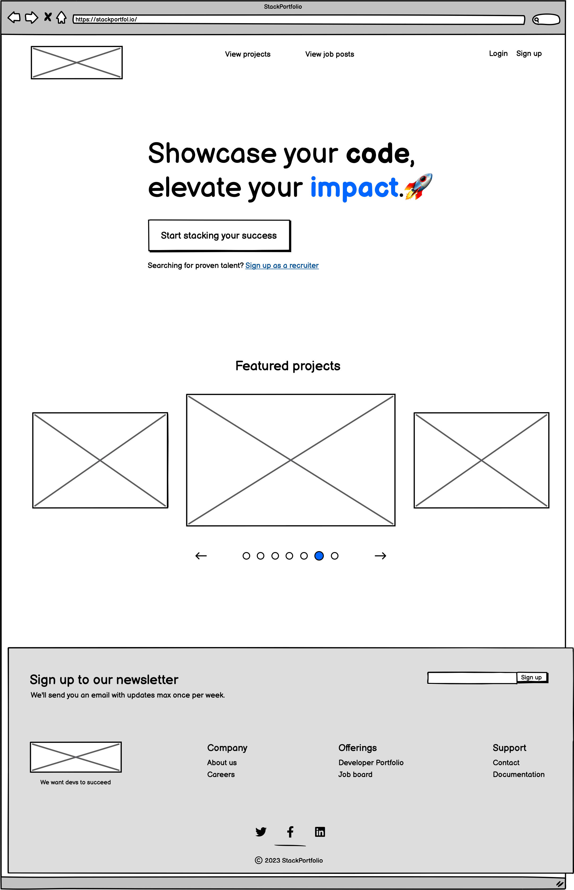

  
Homepage - Mobile (click to expand)

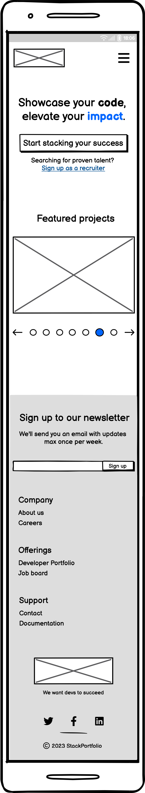

 

  
Forms - Desktop (click to expand)

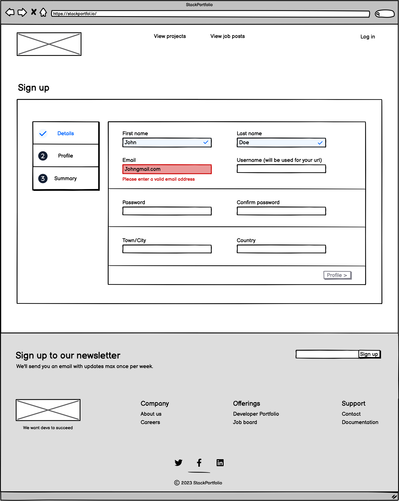

  
Forms - Mobile (click to expand)

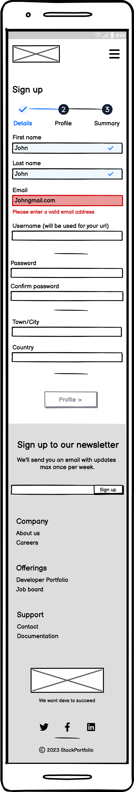

 

  
Tech user profile - Desktop (click to expand)

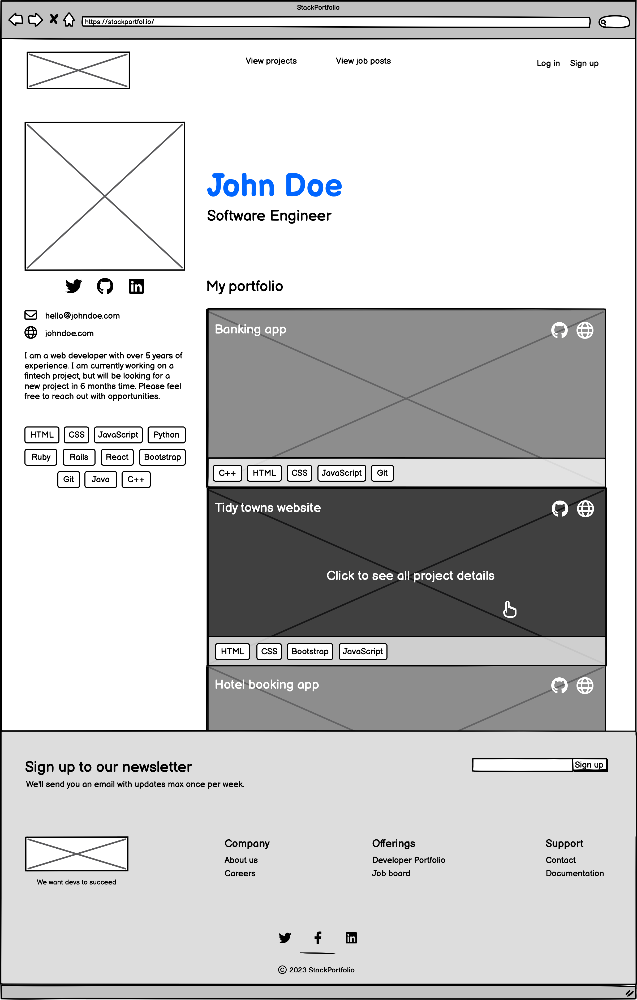

  
Tech user profile - Mobile (click to expand)

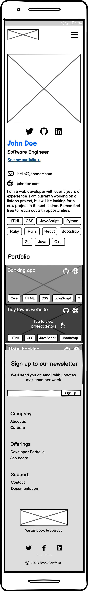

 

  
Project List Page - Desktop (click to expand)

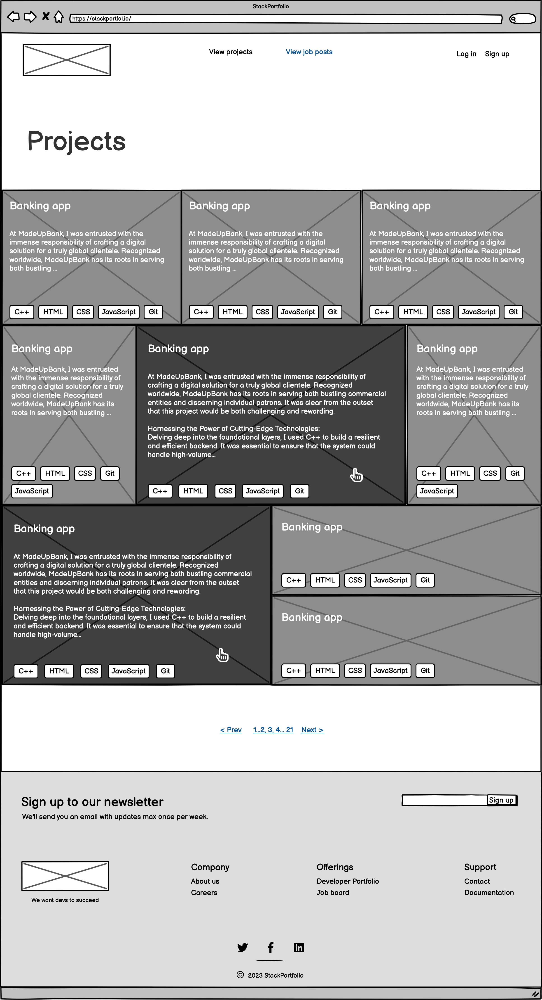

  
Project List Page - Mobile (click to expand)

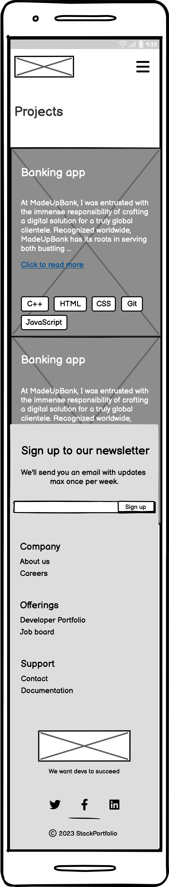

 

  
Project Page - Desktop (click to expand)

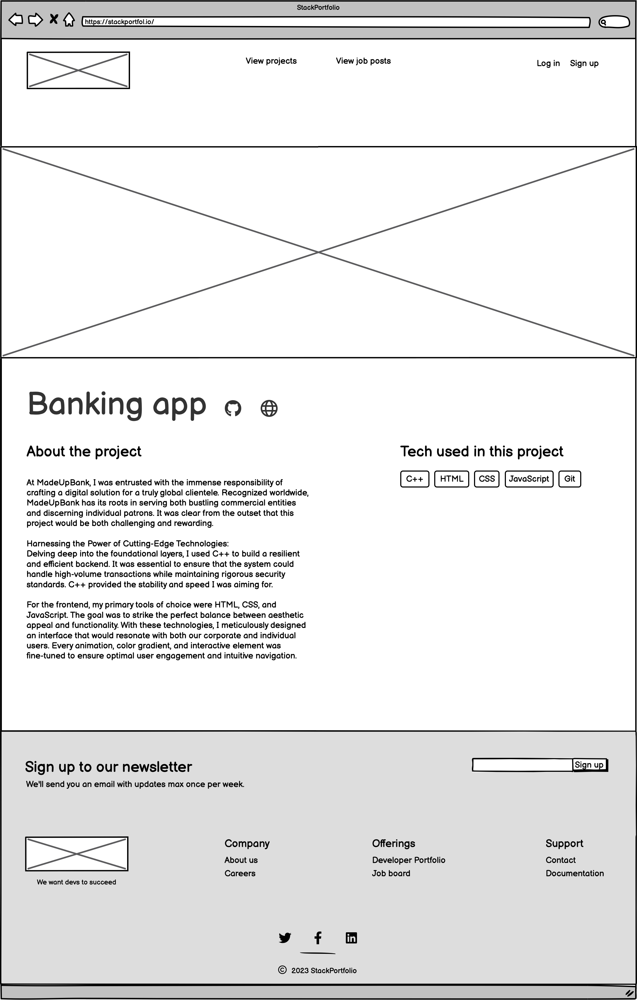

  
Project Page - Mobile (click to expand)

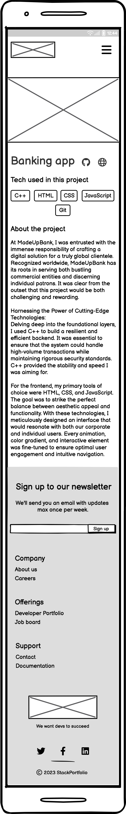

 

  
Recruiter user profile - Desktop (click to expand)

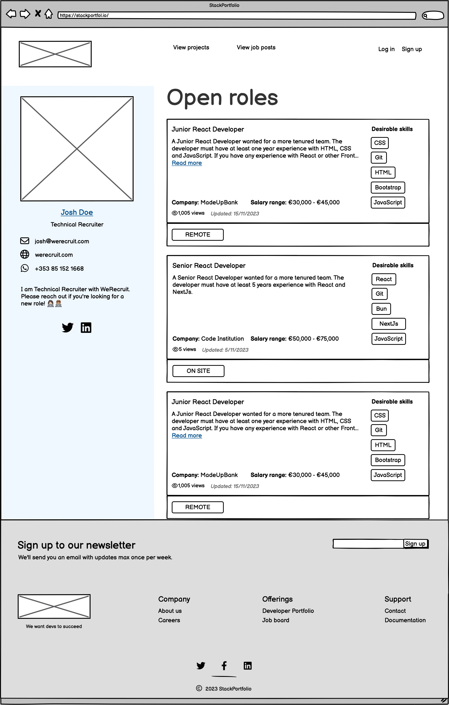

  
Recruiter user profile - Mobile (click to expand)

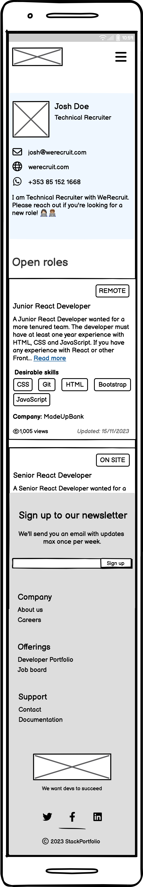

 

  
Job Board - Desktop (click to expand)

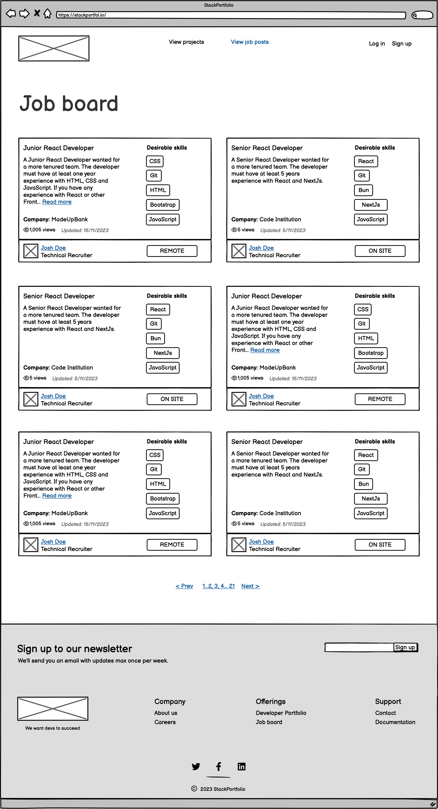

  
Job Board - Mobile (click to expand)

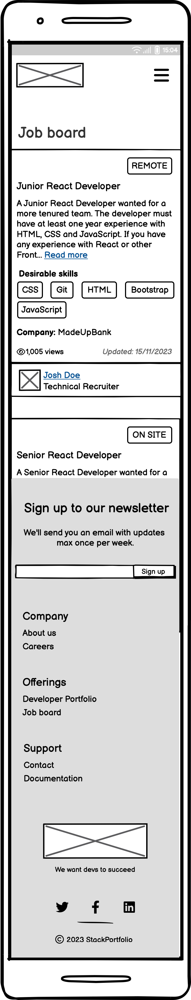

 

  
Job Page - Desktop (click to expand)

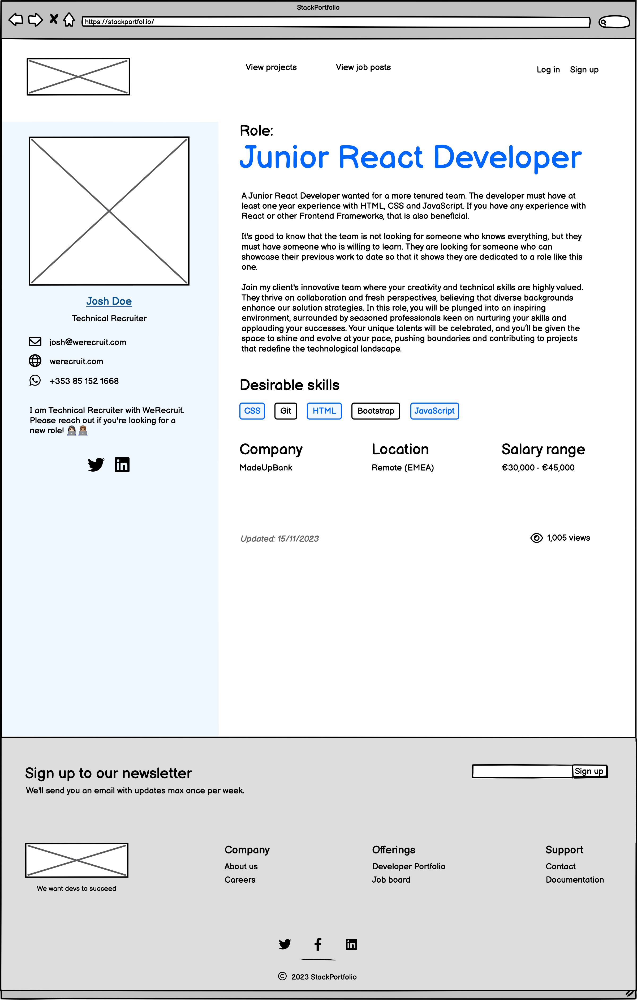

  
Job Page - Mobile (click to expand)

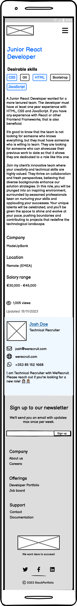

### Entity Relationship Diagram

The Entity Relationship Diagram (ERD) was created using [Draw.io](https://app.diagrams.net/). The ERD is a visual representation of the database structure. It shows the tables, the columns in each table, and the relationships between the tables.

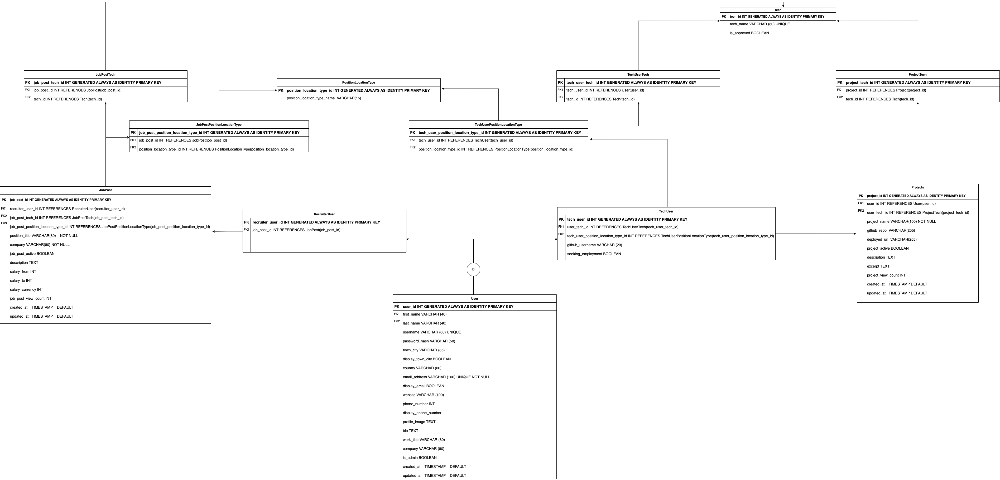

  
Click here to expand and see the first ERD draft

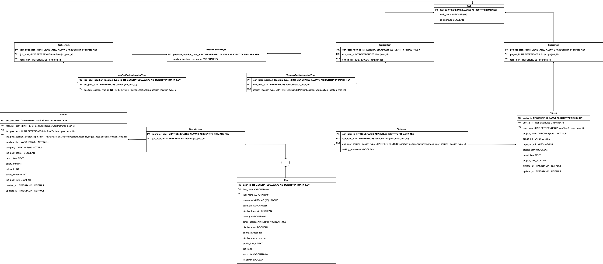

### User flowchart

The user flowchart was created using [Draw.io](https://app.diagrams.net/). The flowchart shows the different paths that a user can take through the site.

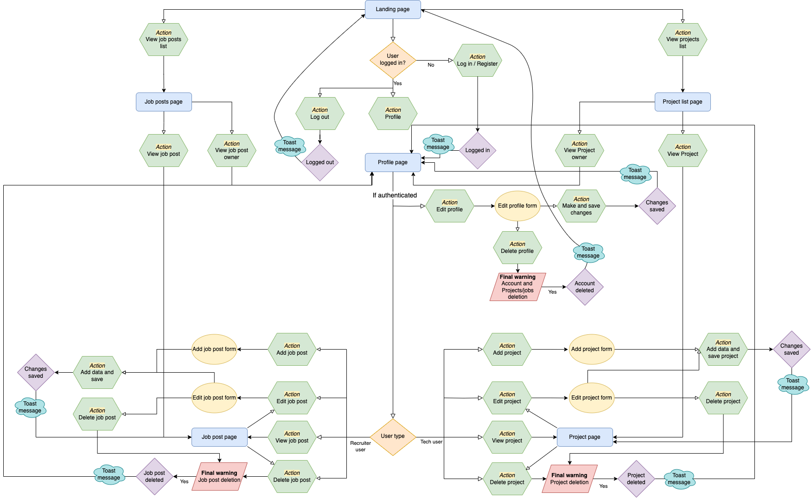

## Resources

- [Creating issue templates on GitHub](https://docs.github.com/en/communities/using-templates-to-encourage-useful-issues-and-pull-requests/configuring-issue-templates-for-your-repository)
- [GitHub Docs on issue templates](https://docs.github.com/en/communities/using-templates-to-encourage-useful-issues-and-pull-requests/about-issue-and-pull-request-templates)
- [GitHub Projects](https://docs.github.com/en/issues/planning-and-tracking-with-projects/learning-about-projects/about-projects) - Project planning board to track progress and issues
- [ER 4 Inheritance video on Entity Relationship Diagrams](https://www.youtube.com/watch?v=ATgYkVTZBiI)
- [Database Design playlist by Caleb Curry](https://www.youtube.com/playlist?list=PL_c9BZzLwBRK0Pc28IdvPQizD2mJlgoID)
- [Draw.io](https://app.diagrams.net/) - Creation of the database Entity Relationship Diagram
- [MoSCoW method - P3 Mastery](https://www.youtube.com/watch?v=j2Fpx1Yj9EQ)
- [Gunicorn documentation](https://docs.gunicorn.org/en/stable/) - Used to deploy the application to Heroku
- [Heroku](https://www.heroku.com/) - Hosting for deployed application
- [dj_database_url](https://pypi.org/project/dj-database-url/0.4.2/)
- [Balsamique](https://balsamiq.com/) - Used to create wireframes
- [Ssali Jonathan playlist on test-driven development with Django](https://www.youtube.com/playlist?list=PLEt8Tae2spYlWWMN5azuYjvoItXDkQ1DQ)
- [Django documentation](https://docs.djangoproject.com/en/3.2/)
- [Geeks for Geeks docs for Python testing](https://www.geeksforgeeks.org/python-unittest-assertisnotnone-function/)
- [Autopep8](https://pypi.org/project/autopep8/) - Used to format Python code
- [Django Allauth](https://docs.allauth.org/en/latest/) - Used for authentication and additional form templates
- [Tailwind CSS](https://tailwindcss.com/) - Used for styling
- [DaisyUI Plugin](https://daisyui.com/) - Used for styling on top of Tailwind
- [Whitenoise](http://whitenoise.evans.io/en/stable/) - Used to serve static files reliably
- [Documentation on extending allauth forms](https://www.geeksforgeeks.org/python-extending-and-customizing-django-allauth/)
- [Slugify Django username](https://www.fullstackpython.com/django-utils-text-slugify-examples.html)
- [LoginRequiredMixin](https://docs.djangoproject.com/en/4.2/topics/auth/default/) - Ensures that the view is only accessible to logged in users
- [Django decorators](https://docs.djangoproject.com/en/4.2/topics/http/decorators/) - using decorators such as `@login_required` and `@require_POST`
- [Issue with Tailwind Styles not applying to form elements on Stackoverflow](https://stackoverflow.com/questions/76729480/django-tailwind-styling-not-applied-to-template-variables-with-widget-attribut)
- [django-cloundinary-storage for working with Cloudinary](https://pypi.org/project/django-cloudinary-storage/)
- [Cloudinary](https://cloudinary.com/) - Used to store and transform images
- [TailwindCSS Form Validation tutorial](https://dev.to/deyemiobaa/adding-custom-validation-to-a-form-with-tailwindcss-1e7d) - Referenced as part of research, but I ended up not using it because of the Pep8 requirements
- [Jest Documentation](https://jestjs.io/docs/getting-started) - Used for testing JavaScript forms
