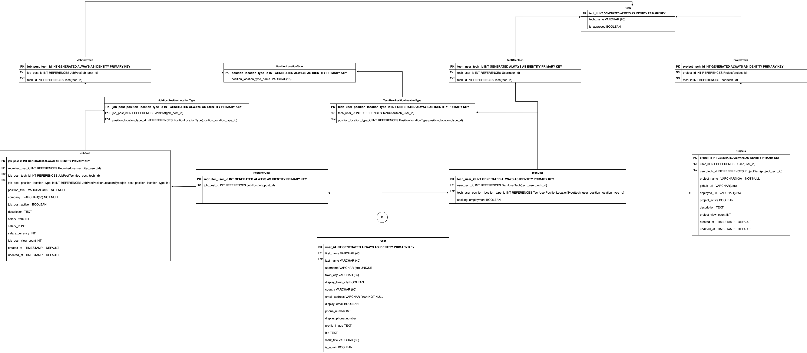

#  StackPortfol.io

StackPortfol.io is a platform that allows Developers to add showcase their projects and associate them with the skills that they used to create them. Since the skills are linked to projects, Recruiters have peace of mind that the Developers they are contacting have the skills that they say they have.

## Planning Phase

###  Site objective

While Developers can use a site such as LinkedIn to add projects, the architecture is set to to serve the needs of a number of different job functions. Due to the fact that the site us not focused on Developers, the project showcase lacks many features that Developers need. Recruiters who are searching for Developers for role lack the evidence that a Developer has the skills for which they are searching. In many cases, a skill might be added to a professional profile just because someone has heard or watched a video about it.

StackPortfol.io allows Developers to showcase their projects, which then allows Recruiters to find Developers who have proven skills for their job postings. It's a win-win for both parties.

###  Opportunities

Being a Developer myself, I have a lot of feature ideas for the Stackportfol.io platform. I have listed them in the table below, rating them by their importance and difficulty. The rating system is based on the MoSCoW method of prioritisation.

| Feature                         | Importance | Difficulty | Project priority |
| ------------------------------- | ---------- | ---------- | ---------------- |
| **Account Features**            |            |            |                  |
| Account creation                | 5          | 3          | Must have        |
| Account login                   | 5          | 3          | Must have        |
| Account logout                  | 5          | 3          | Must have        |
| Account deletion                | 5          | 2          | Must have        |
| Account update                  | 5          | 3          | Must have        |
| Account preferences             | 3          | 4          | Could have       |
| Social login/registration       | 3          | 4          | Could have       |
| **User Features**               |            |            |                  |
| User profiles                   | 5          | 3          | Must have        |
| User profile search             | 3          | 4          | Could have       |
| User messaging system           | 1          | 5          | Won't have       |
| User notifications              | 1          | 5          | Won't have       |
| User activity feed              | 1          | 5          | Won't have       |
| Tech user unique profile URL    | 4          | 3          | Should have      |
| Job seeking types               | 1          | 4          | Won't have       |
| **Project Features**            |            |            |                  |
| Project creation                | 5          | 3          | Must have        |
| Project update                  | 5          | 3          | Must have        |
| Project deletion                | 5          | 3          | Must have        |
| Project search                  | 3          | 4          | Could have       |
| Project tech association        | 5          | 4          | Must have        |
| Project Contributors            | 3          | 5          | Won't have       |
| Project commenting              | 2          | 5          | Won't have       |
| Report job post/project         | 2          | 5          | Won't have       |
| Project/Job post bookmarking    | 2          | 5          | Won't have       |
| **Job Features**                |            |            |                  |
| Job creation                    | 5          | 3          | Must have        |
| Job update                      | 5          | 3          | Must have        |
| Job deletion                    | 5          | 3          | Must have        |
| Job search                      | 2          | 4          | Could have       |
| Job list                        | 4          | 3          | Should have      |
| Job post tech                   | 5          | 3          | Must have        |
| Job remote/on-site/hybrid       | 5          | 2          | Must have        |
| Job post benefits               | 2          | 4          | Won't have       |
| Job post salary                 | 3          | 2          | Should have      |
| Job post application            | 2          | 5          | Won't have       |
| Associate company with job post | 1          | 4          | Won't have       |
| **Tech Features**               |            |            |                  |
| Tech search                     | 4          | 4          | Should have      |
| Tech Aliases                    | 2          | 4          | Won't have       |
| Tech position                   | 1          | 2          | Could have       |
| **Miscellaneous Features**      |            |            |                  |
| Skills for user and project     | 2          | 5          | Won't have       |
| Company creation                | 1          | 5          | Won't have       |

Click here to expand the priority descriptions and percentages

| Priority    | Percentage                | Description                                                                                                                                                            |
| ----------- | ------------------------- | ---------------------------------------------------------------------------------------------------------------------------------------------------------------------- |
| Must have   | 60%                       | These are the features that are essential for the site to be usable. If any of these features are missing, the site will not be usable.                                |
| Should have | 16%                       | These are the features that are important, but not essential. If any of these features are missing, the site will still be usable.                                     |
| Could have  | 14%                       | These are the features that are nice to have, but not essential. If any of these features are missing, the site will still be usable.                                  |
| Won't have  | Excluded from calculation | These are the features that are not essential and will not be implemented in the current project. If any of these features are missing, the site will still be usable. |

### Entity Relationship Diagram

The Entity Relationship Diagram (ERD) was created using [Draw.io](https://app.diagrams.net/). The ERD is a visual representation of the database structure. It shows the tables, the columns in each table, and the relationships between the tables.

## Resources

- [Creating issue templates on GitHub](https://docs.github.com/en/communities/using-templates-to-encourage-useful-issues-and-pull-requests/configuring-issue-templates-for-your-repository)
- [GitHub Docs on issue templates](https://docs.github.com/en/communities/using-templates-to-encourage-useful-issues-and-pull-requests/about-issue-and-pull-request-templates)
- [GitHub Projects](https://docs.github.com/en/issues/planning-and-tracking-with-projects/learning-about-projects/about-projects) - Project planning board to track progress and issues
- [ER 4 Inheritance video on Entity Relationship Diagrams](https://www.youtube.com/watch?v=ATgYkVTZBiI)
- [Database Design playlist by Caleb Curry](https://www.youtube.com/playlist?list=PL_c9BZzLwBRK0Pc28IdvPQizD2mJlgoID)
- [Draw.io](https://app.diagrams.net/) - Creation of the database Entity Relationship Diagram
- [MoSCoW method - P3 Mastery](https://www.youtube.com/watch?v=j2Fpx1Yj9EQ)
