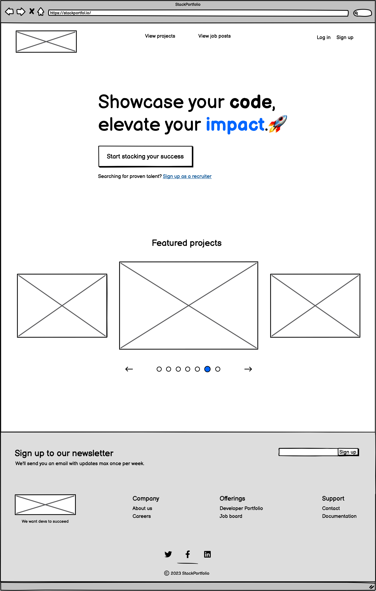
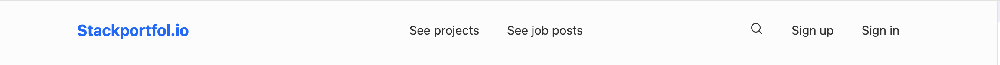
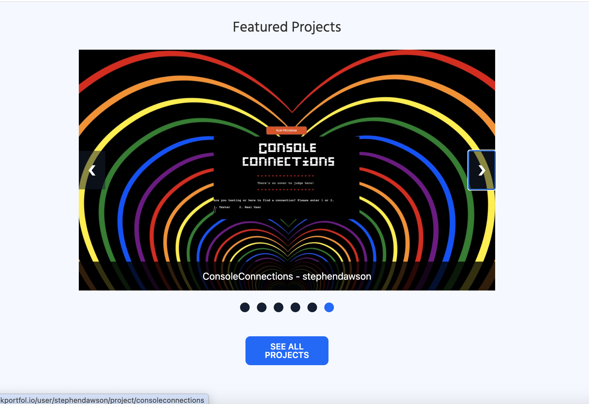

#  StackPortfol.io

StackPortfol.io is a platform that allows Developers to add showcase their projects and associate them with the skills that they used to create them. Since the skills are linked to projects, Recruiters have peace of mind that the Developers they are contacting have the skills that they say they have.

## Planning Phase

###  Site objective

While Developers can use a site such as LinkedIn to add projects, the architecture is set to to serve the needs of a number of different job functions. Due to the fact that the site us not focused on Developers, the project showcase lacks many features that Developers need. Recruiters who are searching for Developers for role lack the evidence that a Developer has the skills for which they are searching. In many cases, a skill might be added to a professional profile just because someone has heard or watched a video about it.

StackPortfol.io allows Developers to showcase their projects, which then allows Recruiters to find Developers who have proven skills for their job postings. It's a win-win for both parties.

###  Opportunities

Being a Developer myself, I have a lot of feature ideas for the Stackportfol.io platform. I have listed them in the table below, rating them by their importance and difficulty. The rating system is based on the MoSCoW method of prioritisation.

| Feature                         | Importance | Difficulty | Project priority |
| ------------------------------- | ---------- | ---------- | ---------------- |
| **Account Features**            |            |            |                  |
| Account creation                | 5          | 3          | Must have        |
| Account login                   | 5          | 3          | Must have        |
| Account logout                  | 5          | 3          | Must have        |
| Account deletion                | 5          | 2          | Must have        |
| Account update                  | 5          | 3          | Must have        |
| Account preferences             | 3          | 4          | Could have       |
| Social login/registration       | 3          | 4          | Could have       |
| **User Features**               |            |            |                  |
| User profiles                   | 5          | 3          | Must have        |
| User profile search             | 3          | 4          | Could have       |
| User messaging system           | 1          | 5          | Won't have       |
| User notifications              | 1          | 5          | Won't have       |
| User activity feed              | 1          | 5          | Won't have       |
| Tech user unique profile URL    | 4          | 3          | Should have      |
| Job seeking types               | 1          | 4          | Won't have       |
| **Project Features**            |            |            |                  |
| Project creation                | 5          | 3          | Must have        |
| Project update                  | 5          | 3          | Must have        |
| Project deletion                | 5          | 3          | Must have        |
| Project search                  | 3          | 4          | Could have       |
| Project tech association        | 5          | 4          | Must have        |
| Project Contributors            | 3          | 5          | Won't have       |
| Project commenting              | 2          | 5          | Won't have       |
| Report job post/project         | 2          | 5          | Won't have       |
| Project/Job post bookmarking    | 2          | 5          | Won't have       |
| **Job Features**                |            |            |                  |
| Job creation                    | 5          | 3          | Must have        |
| Job update                      | 5          | 3          | Must have        |
| Job deletion                    | 5          | 3          | Must have        |
| Job search                      | 2          | 4          | Could have       |
| Job list                        | 4          | 3          | Should have      |
| Job post tech                   | 5          | 3          | Must have        |
| Job remote/on-site/hybrid       | 4          | 2          | Should have      |
| Job post benefits               | 2          | 4          | Won't have       |
| Job post salary                 | 3          | 2          | Should have      |
| Job post application            | 2          | 5          | Won't have       |
| Associate company with job post | 1          | 4          | Won't have       |
| **Tech Features**               |            |            |                  |
| Tech search                     | 3          | 4          | Could have       |
| Tech Aliases                    | 2          | 4          | Won't have       |
| Tech position                   | 1          | 2          | Could have       |
| **Miscellaneous Features**      |            |            |                  |
| Skills for user and project     | 2          | 5          | Won't have       |
| Company creation                | 1          | 5          | Won't have       |
| Expected UI/UX                  | 5          | 2          | Must have        |

  
Click here to expand the priority descriptions and percentages

| Priority    | Percentage                | Description                                                                                                                                                            |
| ----------- | ------------------------- | ---------------------------------------------------------------------------------------------------------------------------------------------------------------------- |
| Must have   | 60%                       | These are the features that are essential for the site to be usable. If any of these features are missing, the site will not be usable.                                |
| Should have | 16%                       | These are the features that are important, but not essential. If any of these features are missing, the site will still be usable.                                     |
| Could have  | 24%                       | These are the features that are nice to have, but not essential. If any of these features are missing, the site will still be usable.                                  |
| Won't have  | Excluded from calculation | These are the features that are not essential and will not be implemented in the current project. If any of these features are missing, the site will still be usable. |

### Scope

Since there are a quite a few features that I would like to implement, I have decided to focus on the core features of the site. The core features are the features that are essential for the site to be usable. The core features are:

- Account management
  - Account creation, updating, and deletion
  - Account login and logout
- User profiles
  - User profiles are created when an account is created
  - User profiles can be updated and deleted
- Project management
  - Projects can be created, updated, and deleted
  - Projects can be associated with a tech user
- Technology management
  - Technologies can be created, but only the Admin should be able to update and delete them
  - Multiple technologies can be associated with a project/job post
- Job post management
  - Job posts can be created, updated, and deleted
  - Job posts can be associated with a recruiter user

Apart from the above, there is also the more general user story of the expected User Experience and User Interface of the site, which I have also included in the scope.

There is also a few features that use search, but I don't feel the functionality is fully required for the Minimum Viable Product (MVP). I have marked many of them as could have and will added user stories to address if time permits near the end of the project.

### User stories and Epics

I have created Epics for each of the core features mentioned in my scope. Here are the planned user stories within each one:

#### Account management

- As a **user**, I can **create an account** so that I can **have my preferences saved**.
- As a **user**, I can **update my personal details** so that I can **ensure my data is accurate and displayed correctly**.
- As a **user**, I can **delete my account** so that I can **have peace of mind that my data is no longer being retained unncessarily**.
- As a **user**, I can **sign up as a tech user or a recruiter** so that I can **use the platform based on my role**.
- As a **user**, I can **log out of my account** so that I can **feel secure when not using my account**.
- As a **user**, I can **choose update by account preferences** so that I can **have more control into how my profile is view and what information is shared**.
- As a **user**, I can **do sign up or log in using a social account** so that I can **easily signup and have my details prepopulated**.

#### User profiles

- As a **user**, I can **have a profile page** so that I can **display my details and projects/jobs**.
- As a **user**, I can **create a unique profile URL** so that I can **easily share my profile with others**.
- As a **user**, I can **search user profiles** so that I can **find friends, colleagues or potential candidates to connect with**.

#### Project management

- As a **tech user**, I can **create a project** so that I can **display it in my portfolio**.
- As a **tech user**, I can **update my project details** so that I can **keep my project relevant to views**.
- As a **tech user**, I can **delete a project** so that I can **keep focus on my most relevant projects**.
- As a **user**, I can **add different technologies to my job posts, projects or profile (tech user)** so that I can **use them for postings or to be associated with those skills**.
- As a **user**, I can **search for projects** so that I can **find a project relevant to my interest or job post**.
- As a **user**, I can **search for projects** so that I can **find a project relevant to my interest or job post**.

#### Job post management

- As a **recruiter user**, I can **create a job post** so that I can **to attract the attention of potential applicants**.
- As a **recruiter user**, I can **update the details of my job post** so that I can **ensure the most up-to-date information about the post is provided**.
- As a **recruiter user**, I can **delete a job post** so that I can **remove out-of-date posts**.
- As a **recruiter user**, I can **specify the job location type** so that I can **ensure only those who match the job location, such as on-site, hybrid or remote show interest in the job**.
- As a **user**, I can **see a job position's salary range** so that I can **decide whether to apply or not**.
- As a **user**, I can **view a list of created job posts** so that I can **view open positions**.
- As a **user**, I can **search jobs** so that I can **find the most relevant job to me**.

#### Technology management

- As a **user**, I can **search for specific technologies** so that I can **see associated job posts or projects with those technologies**.
- As a **tech user**, I can **order the tech on my projects** so that I can **give importance to that tech**.

#### Miscellaneous

- As a **user**, I can **see pages that I expect on a website** so that I can **have a familiar user experience**.

###  Wireframes

I have created wireframes for the main pages of the site. I have used [Balsamique](https://balsamiq.com/) to create the wireframes. Here are the wireframes for the main pages:

  
Homepage - Desktop (click to expand)

  
Homepage - Mobile (click to expand)

 

  
Forms - Desktop (click to expand)

  
Forms - Mobile (click to expand)

 

  
Tech user profile - Desktop (click to expand)

  
Tech user profile - Mobile (click to expand)

 

  
Project List Page - Desktop (click to expand)

  
Project List Page - Mobile (click to expand)

 

  
Project Page - Desktop (click to expand)

  
Project Page - Mobile (click to expand)

 

  
Recruiter user profile - Desktop (click to expand)

  
Recruiter user profile - Mobile (click to expand)

 

  
Job Board - Desktop (click to expand)

  
Job Board - Mobile (click to expand)

 

  
Job Page - Desktop (click to expand)

  
Job Page - Mobile (click to expand)

 

  
Search - Desktop (click to expand)

  
Search - Mobile (click to expand)

### Site Features

The site has a number of standard features, plus some which are specific features that are important for the site's purpose. Here is a list of the features on the site, along with screenshots:

- **Header**
  - The header is a standard header and is responsive so that the menu is collapsed into a hamburger toggle on mobile. I would also like to make this a sticky header in future, but I haven't implemented that yet.

- **Hompeage hero section**
  - The hero section provides a tagline for the site and a sign up call-to-action button and link for developers and recruiters. When logged in, the links change so that it redirects the user to their profile instead.

- **Homepage featured projects slider**
  - The featured slider selects 6 projects randomly and displays them on the homepage. The user can go through the projects and click on the project to go to the project page. There is also a call-to-action button for the user to go to the projects list page.

- **Footer**
  - The final footer is much more minimalistic than my original wireframe. I decided to not add anything that would distract from the primary purpose of the site. I only have one column of links, which lead to the **About** and **Careers** pages. The **Careers** page is a placeholder for now, but I plan to add a page that lists the current job openings at StackPortfol.io. It currerently still allows for the user to email `contact@stackportfol.io` so that expression of interest can be received. In future, I plan to add more items to the footer.

- **Account type**
  - The Account type page allows the user to choose whether they are signing up as a tech user or a recruiter. Tech users can also sign up using GitHub, but recruiters may only sign up using the standard form.

- **Tech signup - Details**
  - The tech signup form is for tech users (developer, testers, etc.) to sign up. The details page collects the user's first name, last name, username, email and password. The username and email must be unique - I validate this serverside, so it doesn't do any async call to check if the user already exists, but I hope to add that in the future. This page asks for the same details on the recruiter signup form.

- **Tech signup - Profile**
  - The profile page collects the user's profile image, bio, location, and website. The user can leave any of these details blank and still complete the signup. This step differs from a recruiter signup as it also asks for a GitHub username, their work location preference and if the user is currently looking for work.

- **Tech signup - Summary**
  - The summary page shows the user a summary of the details they have entered. The user can go back to the previous pages to edit the details if they wish. The user can also submit the form to create their account.

- **Recruiter signup**
  - The recruiter signup is pretty similar to the tech user signup, but it doesn't have as many profile fields. For this reason, this is screenshot is just to show the fact there is a different form.

- **Form validation**
  - There is frontend validation on forms that require it. In this example, I am using the signup form, but other forms on the site also have validation. The validation is also done serverside, so that if the user bypasses the frontend validation, the form will still be validated.

- **Sign in page**
  - The sign in page allows the user to sign in using their username or email and password. The user can also click on the link to go to the sign up page. If it is a tech user, they can also use GitHub to log in. If the email is already in use, it will associate that GitHub account with the existing account. If it doesn't exist, it will create a new account and use the GitHub credentials.

- **User Search**
  - The search page allows the user to search using a query, which searches the user's name. The user can also filter users by their tech skills, whether they have the tech listed or if they have the specific combination of tech queried.

- **Project Search**
  - The project search searches projects by their titles or descriptions. Like with the user search, the user can also filter by tech skills. Only active projects are shown in the search results.

- **Job Post Search**
  - Like the project search, job posts are searched by title or description. The user can also filter by tech skills, but in this case, it will be the required tech skills. Only active job posts are shown in the search results.

- **Search include tech**
  - The include tech functionality allows users to search for any user, project or job post, which contain any of the tech listed.

- **Search match tech**
  - The match tech functionality allows users to search for any user, project or job post, which contain all of the tech listed.

- **Project list**
  - The project list page shows all the projects on the site, with the most recent project shown first. The project page is also paginated so that a max of 12 projects are shown for performance reasons. The user can click on the project to go to the project's detail page.

- **Project detail**
  - The project detail page shows the project's details, including the project's title, description, tech and creator. If the user is the creator of the project, they can also edit or delete the project.

- **Job Posts list**
  - Like the projects list, the jobs list shows all the jobs on the site, with the most recent job shown first. The jobs are also paginated so that a max of 12 jobs are shown for performance reasons. The user can click on the job to go to the job's detail page.

- **Job detail**
  - The job detail page shows the job's details, including the job's title, description, tech and creator. If the user is the creator of the job, they can also edit or delete the job. The job detail page also has a side panel with the poster's details, so they can easily be found or contacted. Job posts can only be posted by users with a recruiter profile, but for the sake of demonstration, my user has both a tech and recruiter profile. For this reason, the poster details in the screenshot has my tech user details, but this would normally be a recruiter's details.

- **Tech user profile**
  - The tech user profile shows the user's details, including their profile image, bio, location, website, GitHub username, work location preference and if they are looking for work. We can also see the user's projects and the tech that they have listed on their profile. If the user is the owner of the profile, they can also edit or delete the profile. The "Add project" button will also only show for the profile owner. To edit the account settings (such as the email or username), the user must access it from the dropdown menu.

- **Recruiter user profile**
  - The recruiter user profile shows the user's details, including their profile image, bio, location and company. We can also see the user's job posts. If the user is the owner of the profile, they can also edit or delete the profile. The "Add job post" button will also only show for the profile owner.

- **Edit profile**
  - If the user owns a profile, they can access the **Edit profile** page. This page contains the optional details of the profile, such as profile image, location or telephone number.

- **Edit account settings**
  - The account settings page allows the user to change their username, email or name. The user currently cannot update their password, but it is a feature that will be added in the future. When the username is updated, it also updates the user's profile URL (slug).

- **Confirmation modal**
  - When a user opts to delete their profile, project or job post, there is a modal popup to confirm that they want to delete the item. This is to prevent accidental deletion. Since this also causes a casade deletion of projects or job posts, I would also like to include more information on the reprecussions in the future.

- **Create Project Form**
  - The create project form is only accessible to users with a tech user profile. They can add the project's title, description, the deployed link, the GitHub repo link, featured image and any tech used on the project. They can also either set it to active or draft. If it is set to draft, it will not be shown on the project list or search.

- **Edit Project Form**
  - The edit project form is only accessible to users with a tech user profile. They can update the same details as the create project form, but also have the current featured image displayed. They can either clear or update the featured image.

- **Inactive project**

  - If a job post or project is set to inactive, it will not show up on the search or project list. However, if a user owns the project or job post, they will see it listed with an "Inactive" badge. This way, they can still access it to edit or delete it.

- **Associated tech**
  - On projects and job posts, the user can add the associated tech. The tech can be added the name and then clicking on the dropdown, or by pressing enter. If the tech is already approved on the backend, the tech badge shows up with the site's primary colour. If is not approved, it will still be added, but show up with the site's secondary colour and have a tooltip showing that it is pending admin approval. Approved tech that is added to a project is automatically added to a user's profile. The user can also remove the tech by clicking on the tech.

- **Create Job Post Form**
  - The create job post form is only accessible to users with a recruiter user profile. They can add the job's title, description, the job's location type, the job's salary range, the location work type, the job's tech requirements and the company. They can also either set it to active or draft. If it is set to draft, it will not be shown on the job list or search.

- **Edit Job Post Form**
  - The edit job post form is only accessible to users with a recruiter user profile. They can update the same details as the create job post form.

- **Domain and SSL**
  - The site is hosted on Render, which provides a free SSL certificate. The site is also hosted on a custom domain, which is `https://stackportfol.io`.

### User flowchart

The user flowchart was created using [Draw.io](https://app.diagrams.net/). The flowchart shows the different paths that a user can take through the site.

### Entity Relationship Diagram

The Entity Relationship Diagram (ERD) was created using [Draw.io](https://app.diagrams.net/). The ERD is a visual representation of the database structure. It shows the tables, the columns in each table, and the relationships between the tables. Here is the ERD from my planning:

Here is the final ERD generated by using Graphviz and Django Extensions:

  
Click here to expand and see the first ERD draft

  
Click here to expand and see the second ERD draft

## Resources

- [Creating issue templates on GitHub](https://docs.github.com/en/communities/using-templates-to-encourage-useful-issues-and-pull-requests/configuring-issue-templates-for-your-repository)
- [GitHub Docs on issue templates](https://docs.github.com/en/communities/using-templates-to-encourage-useful-issues-and-pull-requests/about-issue-and-pull-request-templates)
- [GitHub Projects](https://docs.github.com/en/issues/planning-and-tracking-with-projects/learning-about-projects/about-projects) - Project planning board to track progress and issues
- [ER 4 Inheritance video on Entity Relationship Diagrams](https://www.youtube.com/watch?v=ATgYkVTZBiI)
- [Database Design playlist by Caleb Curry](https://www.youtube.com/playlist?list=PL_c9BZzLwBRK0Pc28IdvPQizD2mJlgoID)
- [Draw.io](https://app.diagrams.net/) - Creation of the database Entity Relationship Diagram
- [MoSCoW method - P3 Mastery](https://www.youtube.com/watch?v=j2Fpx1Yj9EQ)
- [Gunicorn documentation](https://docs.gunicorn.org/en/stable/) - Used to deploy the application to Heroku
- [Heroku](https://www.heroku.com/) - Hosting for deployed application
- [dj_database_url](https://pypi.org/project/dj-database-url/0.4.2/)
- [Balsamique](https://balsamiq.com/) - Used to create wireframes
- [Ssali Jonathan playlist on test-driven development with Django](https://www.youtube.com/playlist?list=PLEt8Tae2spYlWWMN5azuYjvoItXDkQ1DQ)
- [Django documentation](https://docs.djangoproject.com/en/3.2/)
- [Geeks for Geeks docs for Python testing](https://www.geeksforgeeks.org/python-unittest-assertisnotnone-function/)
- [Autopep8](https://pypi.org/project/autopep8/) - Used to format Python code
- [Django Allauth](https://docs.allauth.org/en/latest/) - Used for authentication and additional form templates
- [Tailwind CSS](https://tailwindcss.com/) - Used for styling
- [DaisyUI Plugin](https://daisyui.com/) - Used for styling on top of Tailwind
- [Whitenoise](http://whitenoise.evans.io/en/stable/) - Used to serve static files reliably
- [Documentation on extending allauth forms](https://www.geeksforgeeks.org/python-extending-and-customizing-django-allauth/)
- [Slugify Django username](https://www.fullstackpython.com/django-utils-text-slugify-examples.html)
- [LoginRequiredMixin](https://docs.djangoproject.com/en/4.2/topics/auth/default/) - Ensures that the view is only accessible to logged in users
- [Django decorators](https://docs.djangoproject.com/en/4.2/topics/http/decorators/) - using decorators such as `@login_required` and `@require_POST`
- [Issue with Tailwind Styles not applying to form elements on Stackoverflow](https://stackoverflow.com/questions/76729480/django-tailwind-styling-not-applied-to-template-variables-with-widget-attribut)
- [django-cloundinary-storage for working with Cloudinary](https://pypi.org/project/django-cloudinary-storage/)
- [Cloudinary](https://cloudinary.com/) - Used to store and transform images
- [TailwindCSS Form Validation tutorial](https://dev.to/deyemiobaa/adding-custom-validation-to-a-form-with-tailwindcss-1e7d) - Referenced as part of research, but I ended up not using it because of the Pep8 requirements
- [Jest Documentation](https://jestjs.io/docs/getting-started) - Used for testing JavaScript forms
- [404 Page template code from HyperUI Components](https://www.hyperui.dev/components/application-ui/error-pages#component-2) - Used for 404 and 500 error pages
- [Django documentation on custom error pages](https://docs.djangoproject.com/en/3.2/topics/http/views/#customizing-error-views)
- [Contact form component from Tailwind components](https://tailwindcomponents.com/component/basic-contact-form)
- [Disabling intermediate logout step in allauth](https://stackoverflow.com/questions/18134807/how-to-disable-intermediate-signout-page-in-django-allauth)
- [Widget Tweaks for styling allauth forms](https://pypi.org/project/django-widget-tweaks/)
- [Pylint-Django for better linting](https://pypi.org/project/pylint-django/)
- [Django documentation on the testing client](https://docs.djangoproject.com/en/4.2/topics/testing/tools/#the-test-client)
- [Render - potentially used for hosting](https://render.com)
- [FontJoy for Font pairings](https://fontjoy.com/)
- [Cooolors for colour palette](https://coolors.co/)
- [Tailwind Multiselect component from Tailwind Components](https://tailwindcomponents.com/component/multi-select)
- [Form Input Validity Docs on MDN](https://developer.mozilla.org/en-US/docs/Web/API/ValidityState) - Getting a better understanding of form validation and error messages
- [Stackoverflow post on populating objects in template](https://stackoverflow.com/questions/32389519/django-get-10-random-instances-from-a-queryset-and-order-them-into-a-new-querys)
- [Adapted carousel from Kindacode](https://www.kindacode.com/article/tailwind-css-create-an-image-carousel-slideshow/)
- [Heroicons](https://heroicons.com/) - Used for SVGs
- [Include tag in Django](https://docs.djangoproject.com/en/dev/ref/templates/builtins/#include)
- [distinct() for querying approved tech](https://docs.djangoproject.com/en/dev/ref/models/querysets/#distinct)
- [Canva for creating image placeholders](https://www.canva.com/)
- [Humanize filter for salary ranges](https://docs.djangoproject.com/en/dev/ref/contrib/humanize/#ref-contrib-humanize)
- [Stackoverflow post on many to many field checkboxes](https://stackoverflow.com/questions/1760421/how-can-i-render-a-manytomanyfield-as-checkboxes)
- [Django documentation on ManyToManyField](https://docs.djangoproject.com/en/3.2/ref/models/fields/#manytomanyfield)
- [Django docs on the radio widget](https://docs.djangoproject.com/en/4.2/ref/forms/widgets/#widgets-inheriting-from-the-select-widget)
- [Allauth docs about LinkedIn](https://docs.allauth.org/en/latest/socialaccount/providers/linkedin.html)
- [LinkedIn API docs](https://learn.microsoft.com/en-us/linkedin/consumer/integrations/self-serve/migration-faq?context=linkedin%2Fconsumer%2Fcontext)
- [Medium article on adding GitHub for social login using allauth](https://python.plainenglish.io/django-allauth-a-guide-to-enabling-social-logins-with-github-f820239fb73f)
- [Issue with AllAuth and LinkedIn](https://github.com/pennersr/django-allauth/issues/1641)
- [Social Account Adapter Documentation on AllAuth](https://docs.allauth.org/en/latest/socialaccount/configuration.html) - Used to override the default behaviour of AllAuth Social Signup/Signin
- [LearnDjango tutorial on implementing Search](https://learndjango.com/tutorials/django-search-tutorial)
- [Figma for designing the Favicon](https://www.figma.com/)
- [TestDriven.io on using the post_delete receiver](https://testdriven.io/tips/59a2752f-cdf3-4ba1-806d-15f29811037a/)
- [MDN Article on the search element](https://developer.mozilla.org/en-US/docs/Web/HTML/Element/search)
- [Reason to not convert my M2M tables to a through table](https://forum.djangoproject.com/t/changing-a-manytomanyfield-to-use-a-through-model/10581)
- [Django docs on overriding delete for bulk methods](https://docs.djangoproject.com/en/4.2/topics/db/models/#overriding-model-methods)
- [Django docs on messages levels for toasts](https://docs.djangoproject.com/en/4.2/ref/contrib/messages/#message-levels)
- [Stackoverflow post on custom replace filter](https://stackoverflow.com/questions/21483003/replacing-a-character-in-django-template)
- [Graphiz for creating the ERD](https://graphviz.org/)
- [Django extensions for generating the ERD](https://django-extensions.readthedocs.io/en/latest/graph_models.html)
- [Pyparsing for generating the ERD](https://pypi.org/project/pyparsing/)
- [Stackoverflow Post for fix on why some js files were not loading](https://stackoverflow.com/questions/64171461/collectstatic-whitenoise-cant-see-my-existing-file-on-deployment-to-heroku/)

Known bugs:

1. When the page refreshes on the signup page, the fields are not autofilled.
2. When the page refreshes or form submits on the project or job post create or edit forms, the tech that was added before submission is not re-added.
3. Some fields are missing from the signup summary, e.g. the country and the toggle values.
4. On the search page, unknown tech is not shown in the results, and the tech is removed from the search query. I need to handle unknown tech in the future.
5. Project detail page and job post page can still be accessed when set to draft.
6. Project slugs are not updated when the user updates the project title.
