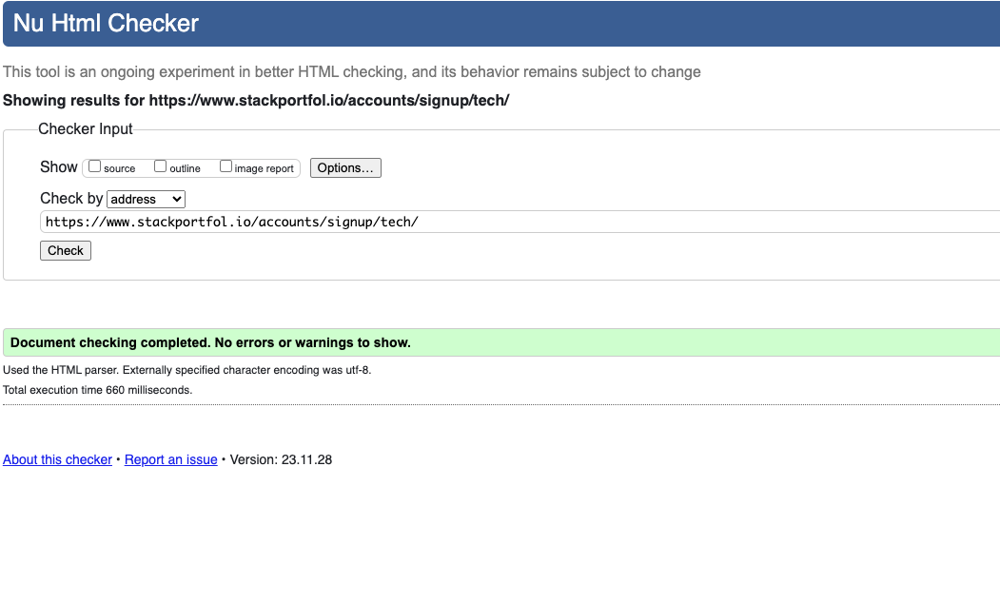
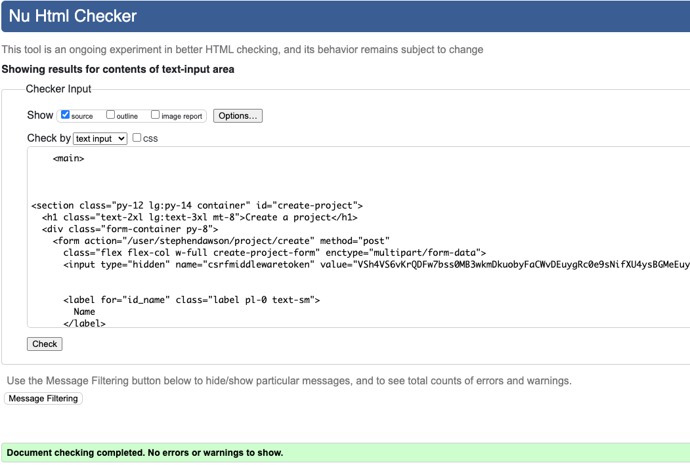
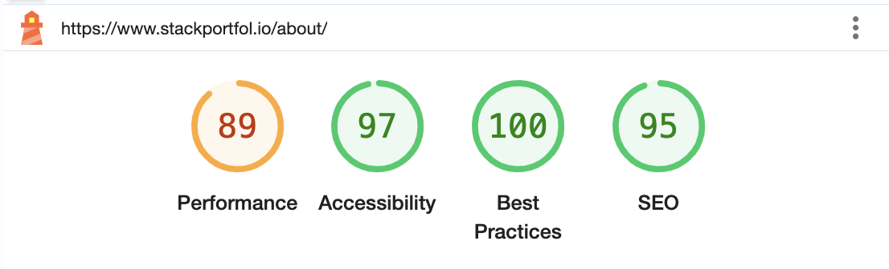

# Testing

[Click here to go back to the README.md file](README.md)

## Overview

I am using a combination of automated and manual testing in my project. I also use different tools for validating the HTML, CSS, JavaScript and Python code. In this testing file, I have also included the performance checks from Google Lighthouse.

## Validation

### HTML

I use the [W3C Markup Validation Service](https://validator.w3.org/) to validate my HTML code.

With Django, theres a lot of syntax that doesn't play well with the HTML Validator, such as `` or `{{ variable|filter }}`.

Normally, I validate by using [validate by uri](https://validator.w3.org/#validate_by_uri) by passing in my deployed URL. However, many pages on this site require a user to be logged-in and authenticated, and will not work using this method, due to the fact that the HTML Validator (W3C) doesn't have access to login to the pages.

In order to properly validate my HTML pages for authenticated pages, I followed these steps:

- Navigate to the deployed pages that require authentication
- Right-click anywhere on the page, and select **View Page Source** (usually `CTRL+U` or `⌘+U` on Mac).
- This will display the entire compiled code.
- Copy everything, and use the [validate by input](https://validator.w3.org/#validate_by_input) method.
- Repeat this process for every page that requires a user to be logged-in/authenticated.

| Page                  | W3C URL                                                                                                                                        | Screenshot                                                                                                     | Notes |
| --------------------- | ---------------------------------------------------------------------------------------------------------------------------------------------- | -------------------------------------------------------------------------------------------------------------- | ----- |
| Homepage              | [W3C Homepage](https://validator.w3.org/nu/?doc=https%3A%2F%2Fwww.stackportfol.io%2F)                                                          |                            | Pass  |
| Signup Type           | [W3C Signup type](https://validator.w3.org/nu/?doc=https%3A%2F%2Fwww.stackportfol.io%2Faccounts%2Fsignup%2F)                                   |                     | Pass  |
| Tech Signup           | [W3C Tech user Signup](https://validator.w3.org/nu/?doc=https%3A%2F%2Fwww.stackportfol.io%2Faccounts%2Fsignup%2Ftech%2F)                       |                             | Pass  |
| Recruiter Signup      | [W3C Recruiter Signup](https://validator.w3.org/nu/?doc=https%3A%2F%2Fwww.stackportfol.io%2Faccounts%2Fsignup%2Frecruiter%2F)                  |                   | Pass  |
| Github Signup         | [W3C Github Signup](https://validator.w3.org/nu/?doc=https%3A%2F%2Fwww.stackportfol.io%2Faccounts%2Fgithub%2Flogin%2F%3Fprocess%3Dsignup)      |                         | Pass  |
| Login                 | [W3C Login Signup](https://validator.w3.org/nu/?doc=https%3A%2F%2Fwww.stackportfol.io%2Faccounts%2Flogin%2F)                                   |                                  | Pass  |
| About page            | [W3C About page](https://validator.w3.org/nu/?doc=https%3A%2F%2Fwww.stackportfol.io%2Fabout%2F)                                                |                             | Pass  |
| Careers page          | [W3C Careers page](https://validator.w3.org/nu/?doc=https%3A%2F%2Fwww.stackportfol.io%careers%2F)                                              |                         | Pass  |
| Search page           | [W3C Search page](https://validator.w3.org/nu/?doc=https%3A%2F%2Fwww.stackportfol.io%2Fsearch)                                                 |                           | Pass  |
| Projects page         | [W3C Projects List page](https://validator.w3.org/nu/?doc=https%3A%2F%2Fwww.stackportfol.io%2Fprojects%2F)                                     |                   | Pass  |
| Project page          | [W3C Project detail page](https://validator.w3.org/nu/?doc=https%3A%2F%2Fwww.stackportfol.io%2Fuser%2Fstephendawson%2Fproject%2Fjudgement-day) |                   | Pass  |
| Profile page          | [W3C Profile page](https://validator.w3.org/nu/?doc=https%3A%2F%2Fwww.stackportfol.io%2Fuser%2Fstephendawson%2F)                               |                         | Pass  |
| Jobs page             | [W3C Jobs List page](https://validator.w3.org/nu/?doc=https%3A%2F%2Fwww.stackportfol.io%2Fjobs%2F)                                             |                               | Pass  |
| Job page              | [W3C Job detail page](https://validator.w3.org/nu/?doc=https%3A%2F%2Fwww.stackportfol.io%2Fuser%2Fstephendawson%2Fjob%2F2%2F)                  |                           | Pass  |
| Edit Account Settings | N/A                                                                                                                                            |  | Pass  |
| Edit Profile          | N/A                                                                                                                                            |                    | Pass  |
| Create Project        | N/A                                                                                                                                            |                | Pass  |
| Edit Project          | N/A                                                                                                                                            |                    | Pass  |
| Create Job Post       | N/A                                                                                                                                            |              | Pass  |
| Edit Job Post         | N/A                                                                                                                                            |                       | Pass  |

### CSS

I use the [W3C CSS Validation Service](https://jigsaw.w3.org/css-validator/) to validate my CSS code. However, there are a number of errors due to using Tailwind CSS on my project. The Jigsaw CSS Validator cannot handle some of the Tailwind Syntax and it throws errors whenever it sees a pseudoelement such as `::before` or `::after`, or a wildcard selector such as `*`. You can [click here to go to the Jigsaw CSS Validation for the site](https://jigsaw.w3.org/css-validator/validator?uri=https%3A%2F%2Fwww.stackportfol.io%2F&profile=css3svg&usermedium=all&warning=0&vextwarning=&lang=en). It turns out that the parsing of CSS variables is the cause. Here is a table of the errors (the repeated and some similar errors have been removed to avoid repetition):

| CSS                                                                            | Error                                                 | Description                                                                               | Reference                                                                                                |
| ------------------------------------------------------------------------------ | ----------------------------------------------------- | ----------------------------------------------------------------------------------------- | -------------------------------------------------------------------------------------------------------- |
| `*, ::before, ::after`                                                         | `Parse Error`                                         | This error is actually about the CSS Variables that Jigsaw cannot support                 | <https://forum.freecodecamp.org/t/css-custom-property-or-variable-gives-validation-error-but-why/234744> |
| `::backdrop`                                                                   | `Parse Error`                                         | This error is also about the CSS Variables that Jigsaw cannot support                     |                                                                                                          |
| `.alert`                                                                       | `Parse Error )`                                       | In this case, it is also a CSS referenced as a hsl value                                  |                                                                                                          |
| `selector(:has(*)) { :where(.join *) { border-radius: inherit; } }`            | `Parse Error`                                         | This error is caused by the `@supports` CSS Declaration, which isn't recognised by Jigsaw | <https://developer.mozilla.org/en-US/docs/Web/CSS/@supports>                                             |
| `])) { overflow: hidden; }`                                                    | `Parse Error`                                         | This error is caused by Jigsaw not being able to parse the `:has` selector                |                                                                                                          |
| `.checkbox:checked, .checkbox[checked="true"], .checkbox[aria-checked="true"]` | `Value Error : background-image Parse Error`          | This CSS also contains CSS Variables, which appear to cause the parsing issue             |                                                                                                          |
| `.checkbox:indeterminate`                                                      | `Value Error : background-image Parse Error`          | Same as above, this contains CSS Variables and Jigsaw cannot parse it                     |                                                                                                          |
| `.menu :where(li:not(.menu-title) >...` (shorted long selector)                | `Property text-wrap doesn't exist : balance`          | This is caused Jigsaw not being able to parse the `:where` selector                       |                                                                                                          |
| `.radio:checked, .radio[aria-checked="true"]`                                  | `Parse Error ) inset, 0 0 0 4px hsl(var(--b1)) inset` | This error is caused by Jigsaw's inability to parse CSS variables                         |                                                                                                          |
| `:root .prose`                                                                 | `Parse Error )`                                       | This is also where CSS variables are being declared and can't be parsed by Jigsaw         |                                                                                                          |
| `.tooltip`                                                                     | `Parse Error [has(:focus-visible):after]`             | It looks like Jigsaw also has difficulty parsing `:has` or other newer pseudoselectors    |                                                                                                          |

The above shows that Jigsaw has trouble parsing CSS Variable, but also newer pdeudoselectors such as `:has`, `:where` and `:is`, which are all now fully supported in modern browsers:

- <https://developer.mozilla.org/en-US/docs/Web/CSS/:has>
- <https://developer.mozilla.org/en-US/docs/Web/CSS/:where>
- <https://developer.mozilla.org/en-US/docs/Web/CSS/:is>

While these newer psudeoselectors have only received support recently, since my main target audience is developers, I am not too concerned about this. I will continue to use these newer selectors. I also saw that Firefox has mixed reports on whether this is fully supported, but when I tested the functionality where these selectors are used, it worked as expected.

### JavaScript

I used [JSHint](https://jshint.com/) to validate my JavaScript code. Here is a table of the validated code, which shows the file validated, a screenshot and a descriptionany warnings:

| File                    | Screenshot                                                                                                                     | Description                                                                                                                                                                                          |
| ----------------------- | ------------------------------------------------------------------------------------------------------------------------------ | ---------------------------------------------------------------------------------------------------------------------------------------------------------------------------------------------------- |
| `script.js`             |                            | Three warnings about functions declared in loops leading to confusing syntax. I reviewed and I feel the syntax is not difficult to comprehend.                                                       |
| `stepperForm.js`        |                     | One warning about a function declared in a loop and one warning about refering outer variables. I reviewed and I feel the syntax is not difficult to comprehend.                                     |
| `fromValidation.js`     |           | Warning about confusing linebreak before `?` being confusing, but I think it makes it easier to read. Also warning about unused HTMLSpanElement, but that is just used to typechecking.              |
| `techSelector.js`       |               | Warning about confusing linebreak before `?` being confusing, but I think it makes it easier to read. A expected assignment, but got an expression - I am using this to toggle a class on an element |
| `searchtechselector.js` |  | Same as warnings `techselector.js`                                                                                                                                                                   |

### Python and Django (Pep 8)

## Performance

I used the Google Chrome Lighthouse tool to test the performance of my app. On both mobile and desktop, there were some common issues that I want to address here. These issues are largely related to Tailwind and Images, which I will be addressing in future. It was expected that I would have issues with user-provided images as I had less control over the size and format they provided. In the below table, I call these "standard issues":

1. `Eliminate render-blocking resources`, `Reduce initial server response time`, `Reduce unused CSS` and `Minify CSS` - These warnings are all related to the use of Tailwind on this project. Since this is my first project with Tailwind, I came up against some issues that I hadn't anticipated. One issue of these is that Tailwind does not add a class to the `tailwind.css` file if it is dynamically rendered or if it is "injected" from the `form.py` file. For this reason, I had to force-add some of the Tailwind classes so that the site appears as expected. This leads to a largeer CSS file, which is why I am getting these warnings. I am not too concerned about this, as I am using Tailwind for the first time and I am still learning how to use it. I will be able to optimise this further in the future, and apply another approach I learned on the project where I am able to use `widget_tweaks` to add the classes in the template file instead of the `forms.py` file. I also do not currently have a way to minify the CSS on the fly, which means the file being used in unminified. In the future, I will be adding a minification step to the deployment process.

2. `Largest Contentful Paint element` and `Properly size images` - These warnings are related to the images on the site. While I have been able to convert images to Webp, I did not have time to resize all the images so that the correct size is being used. I would like to do this in the future, but I am also considering changing from Cloudinary to AWS, so this is something that I will address in the future.

3. `Serve static assets with an efficient cache policy` - This warning is related to the fact that I am using Cloudinary to serve my static assets. This is handled by Cloudinary and I don't currently know how to change this. I will be looking into this in the future.

4. `Elements with visible text labels do not have matching accessible names.` - I get this error for accessibility for any of my cards with images and an `aria-label`. The error indicates that screen readers will have a confusing experience as the aria label does not match the inner text. However, I tested this with a screen reader and it works as expected, and even provides a better experience than if there were no aria label.

5. `Issues were logged in the Issues panel in Chrome Devtools` - This is a warning regarding the [phasing out of third-party cookies](https://developers.google.com/privacy-sandbox/3pcd). I will not be addressing this as a part of this project's sprints, but I will be looking into this in the future.

6. `Image elements do not have explicit width and height` - This is due to some issues with responsiveness, but I will be addressing these in the future. I understand this is good to have to prevent Cumulative Layout Shift (CLS).

7. `Heading elements are not in a sequentially-descending order` is occurring on pages where there are no h2s, but there are always h3s in the footer.

Here are the results:

### Mobile performance

| Page URL                                                                                       | Lighthouse Screenshot                                                                                          | Comments               |
| ---------------------------------------------------------------------------------------------- | -------------------------------------------------------------------------------------------------------------- | ---------------------- |
| [Homepage mobile](https://stackportfol.io)                                                     |                                | Pass - Standard issues |
| [Projects List mobile](https://stackportfol.io/projects)                                       |                           | Pass - Standard issues |
| [Project Detail mobile](https://www.stackportfol.io/user/stephendawson/project/stackportfolio) |                           | Pass - Standard issues |
| [Jobs List mobile](https://stackportfol.io/jobs)                                               |                               | Pass - Standard issues |
| [Job Detail mobile](https://www.stackportfol.io/user/stephendawson/job/2/)                     |                              | Pass - Standard issues |
| [Search page](https://www.stackportfol.io/search/?q=project)                                   |                                    | Pass - Standard issues |
| [Account type](https://www.stackportfol.io/accounts/signup/)                                   |                        | Pass - Standard issues |
| [Tech Signup](https://www.stackportfol.io/accounts/signup/tech/)                               |                          | Pass - Standard issues |
| [Recruiter Signup](https://www.stackportfol.io/accounts/signup/recruiter/)                     |                | Pass - Standard issues |
| [Signin](https://www.stackportfol.io/accounts/login/)                                          |                                    | Pass - Standard issues |
| [Profile page](https://www.stackportfol.io/user/stephendawson/)                                |                             | Pass - Standard issues |
| [Profile Edit Form](https://www.stackportfol.io/user/stephendawson/edit/)                      |                   | Pass - Standard issues |
| [Account Settings Edit Form](https://www.stackportfol.io/user/stephendawson/settings/)         |  | Pass - Standard issues |
| [Create Project](https://www.stackportfol.io/user/stephendawson/project/create)                |                    | Pass - Standard issues |
| [Edit Project](https://www.stackportfol.io/user/stephendawson/project/stackportfolio/edit/)    |                        | Pass - Standard issues |
| [Create Job Post](https://www.stackportfol.io/user/stephendawson/job/create)                   |                  | Pass - Standard issues |
| [Edit Job Post](https://www.stackportfol.io/user/stephendawson/job/2/edit/)                    |                      | Pass - Standard issues |
| [About page](https://www.stackportfol.io/about/)                                               |                                      | Pass - Standard issues |
| [Careers page](https://www.stackportfol.io/careers/)                                           |                                  | Pass - Standard issues |

### Desktop performance

| Page URL                                                                                        | Lighthouse Screenshot                                                                                           | Comments               |
| ----------------------------------------------------------------------------------------------- | --------------------------------------------------------------------------------------------------------------- | ---------------------- |
| [Homepage desktop](https://stackportfol.io)                                                     |                                | Pass - Standard issues |
| [Projects List desktop](https://stackportfol.io/projects)                                       |                           | Pass - Standard issues |
| [Project Detail desktop](https://www.stackportfol.io/user/stephendawson/project/stackportfolio) |                           | Pass - Standard issues |
| [Jobs List desktop](https://stackportfol.io/jobs)                                               |                               | Pass - Standard issues |
| [Job Detail desktop](https://www.stackportfol.io/user/stephendawson/job/2/)                     |                              | Pass - Standard issues |
| [Search page](https://www.stackportfol.io/search/?q=project)                                    |                                    | Pass - Standard issues |
| [Account type](https://www.stackportfol.io/accounts/signup/)                                    |                        | Pass - Standard issues |
| [Tech Signup](https://www.stackportfol.io/accounts/signup/tech/)                                |                          | Pass - Standard issues |
| [Recruiter Signup](https://www.stackportfol.io/accounts/signup/recruiter/)                      |                | Pass - Standard issues |
| [Signin](https://www.stackportfol.io/accounts/login/)                                           |                                    | Pass - Standard issues |
| [Profile page](https://www.stackportfol.io/user/stephendawson/)                                 |                             | Pass - Standard issues |
| [Profile Edit Form](https://www.stackportfol.io/user/stephendawson/edit/)                       |                   | Pass - Standard issues |
| [Account Settings Edit Form](https://www.stackportfol.io/user/stephendawson/settings/)          |  | Pass - Standard issues |
| [Create Project](https://www.stackportfol.io/user/stephendawson/project/create)                 |                    | Pass - Standard issues |
| [Edit Project](https://www.stackportfol.io/user/stephendawson/project/stackportfolio/edit/)     |                        | Pass - Standard issues |
| [Create Job Post](https://www.stackportfol.io/user/stephendawson/job/create)                    |                  | Pass - Standard issues |
| [Edit Job Post](https://www.stackportfol.io/user/stephendawson/job/2/edit/)                     |                      | Pass - Standard issues |
| [About page](https://www.stackportfol.io/about/)                                                |                                      | Pass - Standard issues |
| [Careers page](https://www.stackportfol.io/careers/)                                            |                                  | Pass - Standard issues |

## Manual Testing

I carried out manual testing according to my user stories. I carried the tests out on Google Chrome, Mozilla Firefox and Safari on Macbook.

| User story - As a user, I can...                                                                                                         | Notes                                    | Chrome | Firefox | Safari |
| ---------------------------------------------------------------------------------------------------------------------------------------- | ---------------------------------------- | ------ | ------- | ------ |
| **create an account** so that I can **have my preferences saved**.                                                                       | Creates a recruiter or tech user profile | Pass   | Pass    | Pass   |
| **update my personal details** so that I can **ensure my data is accurate and displayed correctly**.                                     |
| **delete my account** so that I can **have peace of mind that my data is no longer being retained unncessarily**.                        |
| **sign up as a tech user or a recruiter** so that I can **use the platform based on my role**.                                           |
| **log out of my account** so that I can **feel secure when not using my account**.                                                       |
| **choose update by account preferences** so that I can **have more control into how my profile is view and what information is shared**. |
| **do sign up or log in using a social account** so that I can **easily signup and have my details prepopulated**.                        |

## Automated Testing

### Account

#### Create Account

##### Create Account Unittest

| Test Name                                   | Description                                                         | Status |
| ------------------------------------------- | ------------------------------------------------------------------- | ------ |
| `test_check_create_user_view_exists`        | Test that the User model is not none                                | Pass   |
| `test_create_and_retrieve_user`             | Test for creating and retrieving a user                             | Pass   |
| `test_additional_user_fields_exist`         | Test that additional user fields exist                              | Pass   |
| `test_create_user_with_empty_email`         | Test that the user cannot sign up with an empty email               | Pass   |
| `test_create_user_with_invalid_email`       | Test that the user cannot sign up with an invalid email             | Pass   |
| `test_email_already_exists`                 | Test that the user cannot sign up with an email that already exists | Pass   |
| `test_create_user_with_empty_username`      | Test that the user cannot sign up with an empty username            | Pass   |
| `test_create_user_with_short_username`      | Test that the user cannot sign up with a short username             | Pass   |
| `test_create_user_with_long_username`       | Test that the user cannot sign up with a long username              | Pass   |
| `test_create_user_with_symbols_in_username` | Test that the user cannot sign up with symbols in the username      | Pass   |
| `test_create_user_with_empty_first_name`    | Test that the user cannot sign up with an empty first name          | Pass   |
| `test_create_user_with_short_first_name`    | Test that the user cannot sign up with a short first name           | Pass   |
| `test_create_user_with_long_first_name`     | Test that the user cannot sign up with a long first name            | Pass   |

##### Create Account Jest

| Test Name                                             | Description                                                 | Status |
| ----------------------------------------------------- | ----------------------------------------------------------- | ------ |
| `function exists`                                     | Test that the validate input function exists                | Pass   |
| `shows error if input is empty, touched and required` | Check that an empty input is invalid                        | Pass   |
| `shows error if input is multiple spaces`             | Check that an input cannot be filled with blank spaces      | Pass   |
| `shows error if input is less than 2 characters`      | Check that a text input cannot have fewer than 2 characters | Pass   |

#### Update Account

##### Update Account Unittest

| Test Name                        | Description                              | Status |
| -------------------------------- | ---------------------------------------- | ------ |
| `test_update_user_email`         | Test that the email gets updated         | Pass   |
| `test_update_user_phone_number`  | Test that the phone number gets updated  | Pass   |
| `test_toggle_user_email_display` | Test that the email display gets toggled | Pass   |
| `test_update_multiple_fields`    | Test that multiple fields get updated    | Pass   |

#### Delete Account

##### Delete Account Unittest

| Test Name          | Description                     | Status |
| ------------------ | ------------------------------- | ------ |
| `test_delete_user` | Test that the user gets deleted | Pass   |

---

### Project

#### Create Project

##### Project Unittest

| Test Name                                     | Description                                                       | Status |
| --------------------------------------------- | ----------------------------------------------------------------- | ------ |
| `test_check_model_is_not_none`                | Test that the Project model is not none                           | Pass   |
| `test_create_project`                         | Test that a project can be created                                | Pass   |
| `test_project_without_project_name`           | Test that a project cannot be created without a project name      | Pass   |
| `test_project_without_user`                   | Test that a project cannot be created without a user              | Pass   |
| `test_project_name_fewer_than_100_characters` | Test that a project cannot be created with a long project name    | Pass   |
| `test_project_without_tech_user_profile`      | Test that a project cannot be created without a tech user profile | Pass   |
| `test_unique_project_name`                    | Test that a user's project has a unique name                      | Pass   |

#### Update Project

##### Update Project Unittest

| Test Name                                | Description                                                   | Status |
| ---------------------------------------- | ------------------------------------------------------------- | ------ |
| `test_project_update`                    | Test that a project can be updated                            | Pass   |
| `test_update_project_with_existing_name` | Test that a project cannot be updated with an existing name   | Pass   |
| `test_update_project_with_invalid_url`   | Test that a project cannot be updated with an invalid URL     | Pass   |
| `test_update_project_description_length` | Test that a project cannot be updated with a long description | Pass   |
| `test_update_project_without_changes`    | Test that a project cannot be updated without changes         | Pass   |

#### Project Detail

##### Project Detail Unittest

| Test Name                         | Description                              | Status |
| --------------------------------- | ---------------------------------------- | ------ |
| `test_project_detail_view_exists` | Test that the Project Detail view exists | Pass   |

#### Project List

##### Project List Unittest

| Test Name                       | Description                            | Status |
| ------------------------------- | -------------------------------------- | ------ |
| `test_project_list_view_exists` | Test that the Project List view exists | Pass   |

---

### Job Post

#### Create Job Post

##### Create Job Post Unittest

| Test Name                                      | Description                                                        | Status |
| ---------------------------------------------- | ------------------------------------------------------------------ | ------ |
| `test_job_post_creation`                       | Test that a job can be created                                     | Pass   |
| `test_job_post_creation_with_no_user`          | Test that a job cannot be created without a user                   | Pass   |
| `test_job_post_without_recruiter_user_profile` | Test that a job cannot be created without a recruiter user profile | Pass   |
